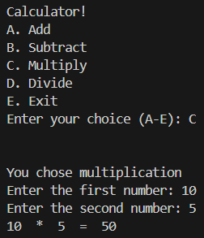

# Python Calculator

A minimal command-line calculator written in Python. It supports basic arithmetic operations: addition, subtraction, multiplication, and division.

---

  

---

## Features
- Addition (+)
- Subtraction (−)
- Multiplication (×)
- Division (÷)
- Handles invalid input